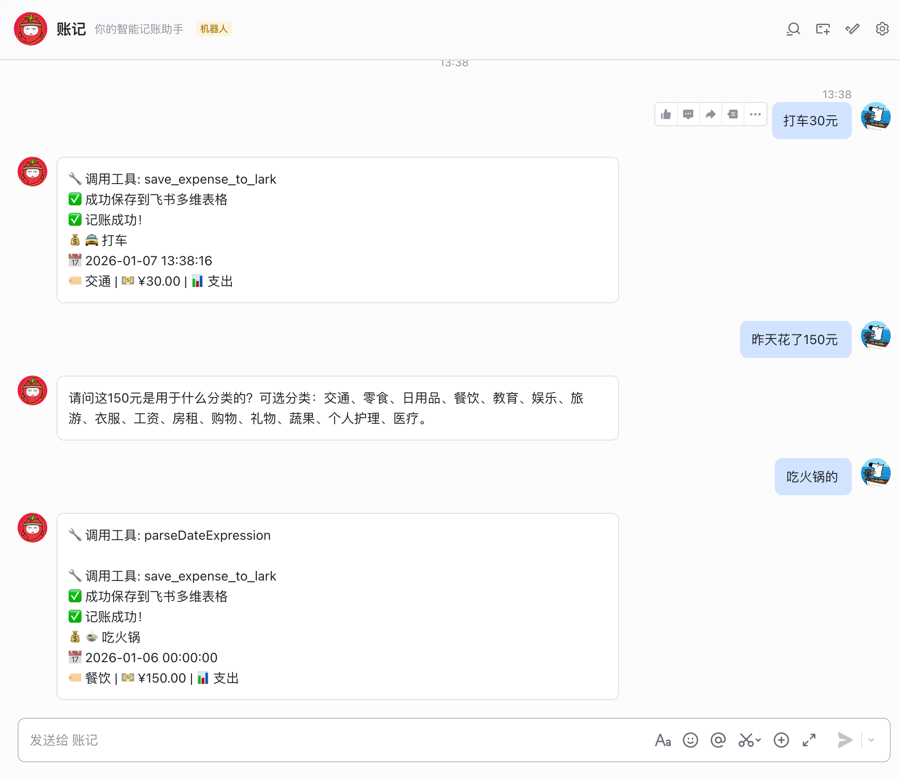

# 智能记账 Agent

基于 LangChain 的智能记账助手，通过自然语言对话帮你记录每一笔消费和收入，并自动保存到飞书多维表格。



## ✨ 特性

- 🤖 **智能对话**：通过自然语言交互，无需手动填写表单
- 📝 **自动分类**：智能识别消费/收入类型和分类
- 📊 **飞书集成**：数据自动保存到飞书多维表格，方便管理和分析
- 💬 **多轮对话**：自动收集缺失信息，友好提醒
- 🤖 **飞书机器人**：直接在飞书中通过对话完成记账
- 🔒 **类型安全**：使用 TypeScript + Zod 确保数据准确性

## 🚀 快速开始

### 1. 环境准备

确保你已安装 Node.js (v18+) 和 pnpm：

```bash
# 安装 pnpm（如果还没有）
npm install -g pnpm
```

### 2. 安装依赖

```bash
pnpm install
```

### 3. 配置环境变量

复制 `.env.example` 为 `.env` 并填入配置：

```bash
cp .env.example .env
```

需要配置以下内容：

#### API 配置（必填）

```env
# LLM API 配置
OPENAI_API_KEY=your-api-key-here
OPENAI_BASE_URL=https://ark.cn-beijing.volces.com/api/v3
MODEL_NAME=doubao-seed-1-6-251015
```

**支持的服务商**：

- **字节跳动豆包**（推荐）

  - `OPENAI_BASE_URL=https://ark.cn-beijing.volces.com/api/v3`
  - `MODEL_NAME=doubao-seed-1-6-251015`

- **OpenAI**
  - `OPENAI_BASE_URL=https://api.openai.com/v1`
  - `MODEL_NAME=gpt-4o-mini`

#### 飞书多维表格配置（必填）

1. 在[飞书开放平台](https://open.feishu.cn/)创建应用，获取 `app_id` 和 `app_secret`
2. 创建一个多维表格，添加以下字段：
   - `备注`（文本）
   - `分类`（单选：交通、零食、日用品、餐饮、教育、娱乐、旅游、衣服、工资、房租、购物、礼物、蔬果、个人护理、医疗）
   - `金额`（数字）
   - `收支`（单选：支出、收入）
   - `日期`（日期）
3. 从表格 URL 中提取 `app_token` 和 `table_id`

```env
FEISHU_APP_ID=your-feishu-app-id
FEISHU_APP_SECRET=your-feishu-app-secret
FEISHU_APP_TOKEN=your-bitable-app-token
FEISHU_TABLE_ID=your-table-id
```

#### LangSmith 追踪配置（可选）

用于调试和追踪 Agent 执行过程：

```env
LANGCHAIN_TRACING_V2=true
LANGCHAIN_API_KEY=your-langsmith-api-key
LANGCHAIN_PROJECT=expense-tracker-agent
```

### 4. 启动项目

项目提供两种运行方式：

#### 方式一：飞书机器人模式（推荐）

直接在飞书中与机器人对话完成记账：

```bash
# 启动飞书机器人服务器
pnpm dev:server
```

服务器启动后，在飞书中向你的机器人发送消息即可开始记账。

#### 方式二：命令行调试模式

在命令行中与 Agent 对话（适合开发调试）：

```bash
# 开发模式（热重载）
pnpm dev

# 生产模式
pnpm start
```

### 5. 开始记账

#### 在飞书中使用（推荐）

启动服务器后，在飞书中向机器人发送消息：

```
你: 今天中午吃了肯德基，花了 55 元

机器人: 好的，我已经记录了这笔支出：
- 备注：今天中午吃了肯德基
- 分类：餐饮
- 金额：55 元
- 类型：支出
- 日期：2025-01-02

已成功保存到飞书多维表格！✅
```

**多轮对话示例**：

```
你: 花了 50 元

机器人: 请问这是什么类型的消费？

你: 餐饮

机器人: 好的，已记录：
- 金额：50 元
- 分类：餐饮
- 日期：今天
- 类型：支出

已保存！✅
```

#### 在命令行中调试

适合开发时测试 Agent 行为：

```
你: 昨天打车花了20元

Agent: 好的，我已经记录了这笔支出：
- 备注：昨天打车花了20元
- 分类：交通
- 金额：20 元
- 类型：支出
- 日期：2025-01-01

已成功保存到飞书多维表格！✅
```

## 📂 项目结构

```
expense-tracker-agent/
├── src/
│   ├── agent.ts              # Agent 主逻辑（LangGraph）
│   ├── prompts.ts            # 系统提示词
│   ├── types.ts              # 类型定义
│   ├── tools/                # Agent 工具函数
│   │   ├── index.ts
│   │   ├── parse-date-expression.ts  # 日期解析工具
│   │   └── save-expense.ts           # 保存到飞书的工具
│   ├── utils/                # 工具函数
│   │   └── date-parser.ts    # 日期解析逻辑
│   ├── server/               # 飞书机器人服务器层
│   │   ├── app.ts            # 服务器入口
│   │   ├── controller/       # 消息控制器
│   │   │   └── message.ts    # 消息路由和处理
│   │   ├── service/          # 服务层
│   │   │   └── agent-invoker.ts  # Agent 调用封装
│   │   └── lark/             # 飞书集成
│   │       ├── client.ts     # WebSocket 连接管理
│   │       └── sender.ts     # 消息发送和更新
│   └── index.ts              # 命令行入口
├── openspec/                 # OpenSpec 规范管理
│   ├── specs/                # 功能规格说明
│   └── changes/              # 变更提案
├── .env                      # 环境变量配置（不提交）
├── .env.example              # 环境变量示例
└── package.json
```

**架构说明**：

- **Agent 层**：独立的 LangChain Agent，可在 LangGraph Studio 中单独测试
- **Server 层**：飞书机器人服务器，通过 WebSocket 接收消息并调用 Agent
- **接口分离**：Server 层通过 `AgentInvoker` 接口调用 Agent，两者完全解耦

## 🛠️ 技术栈

- **LangChain**：AI Agent 框架
- **LangGraph**：Agent 状态管理
- **Express**：HTTP 服务器
- **WebSocket**：飞书事件实时推送
- **Zod**：运行时类型校验
- **TypeScript**：类型安全
- **飞书开放平台**：数据存储和机器人集成

## 📝 支持的分类

- 支出类：交通、零食、日用品、餐饮、教育、娱乐、旅游、衣服、购物、礼物、蔬果、个人护理、医疗
- 收入类：工资、房租

## 🔧 开发

```bash
# 编译 TypeScript
pnpm build

# 清理构建产物
pnpm clean

# 启动飞书机器人服务器
pnpm dev:server

# 运行 LangGraph Studio（可视化调试 Agent）
pnpm agent

# 命令行模式测试 Agent
pnpm dev
```

**调试建议**：
- 使用 `pnpm agent` 在 LangGraph Studio 中调试 Agent 逻辑
- 使用 `pnpm dev:server` 测试飞书机器人完整流程
- 查看日志输出，Agent 调用和飞书 API 请求都有详细日志

## 📄 License

MIT
